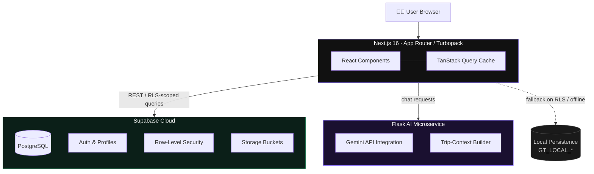

<div align="center">


# GlobeTrotter

**The AI travel concierge that plans, schedules, and publishes your next journey.**

<p>
  <a href="#-quick-start"><b>Quick Start</b></a> ·
  <a href="#-features"><b>Features</b></a> ·
  <a href="#-architecture"><b>Architecture</b></a> ·
  <a href="#-tech-stack"><b>Tech Stack</b></a> ·
  <a href="#-roadmap"><b>Roadmap</b></a>
</p>

<br/>

<table>
<tr>
<td align="center"><a href="https://nextjs.org/"></a></td>
<td align="center"><a href="https://www.typescriptlang.org/"></a></td>
<td align="center"><a href="https://supabase.com/"></a></td>
<td align="center"><a href="https://tailwindcss.com/"></a></td>
<td align="center"><a href="https://ai.google.dev/"></a></td>
</tr>
<tr>
<td align="center" colspan="1"><a href="https://www.odoo.com/"></a></td>
<td align="center" colspan="1"></td>
<td align="center" colspan="1"><a href="#-contributing"></a></td>
</tr>
</table>

</div>

<br/>

<div align="center">
<table>
<tr>
<td width="100%" align="center">

### Travel planning is fragmented. GlobeTrotter isn't.

No more juggling blogs, spreadsheets, calendar apps, and AI chat windows just to plan one trip.
GlobeTrotter merges **AI itinerary generation**, **multi-stop trip building**, a **synced travel calendar**,
and a **community of storytellers** into one dark-mode, editorial-grade platform.

</td>
</tr>
</table>
</div>

<br/>

## ✨ Features

<table>
<tr>
<td width="50%" valign="top">

### 🗺️ Dynamic Itinerary Builder
`/itinerary/new` · `/itinerary/[id]`

Build a trip to any city, country, or region on Earth. Add unlimited stops and activities, each with its own budget line, and let the **automated preset generator** seed your itinerary with landmark tours, food trails, and cultural experiences instantly.

</td>
<td width="50%" valign="top">

### 📅 Bi-Directional Calendar
`/calendar`

Every departure, hotel stay, and activity syncs into a live calendar grid — automatically. Full CRUD on events, color-coded status indicators, and one click from any trip banner straight back into its itinerary.

</td>
</tr>
<tr>
<td width="50%" valign="top">

### 🤖 AI Travel Concierge
`/api/chat` · Flask microservice

A Gemini-powered assistant that knows your actual trip — your destinations, your dates. Ask it for hidden gems, local etiquette, or a packing list built around your itinerary, not a generic one.

</td>
<td width="50%" valign="top">

### 📰 Editorial Community
`/community`

Publish travel journals with photo galleries, do's-and-don'ts, and first-hand recommendations. Browse a feed of real stories from real travelers — no stock-photo listicles.

</td>
</tr>
<tr>
<td width="50%" valign="top">

### 🏛️ Discover Directory
`/discover`

Curated city guides with local specialties, average daily spend, and the best season to go — built for fast trip inspiration.

</td>
<td width="50%" valign="top">

### 🛡️ Offline-Safe by Design

A Supabase-first, client-always strategy. Local persistence fallbacks (`GT_LOCAL_TRIPS`, `GT_LOCAL_STOPS`, `GT_LOCAL_ACTIVITIES`, `GT_LOCAL_CALENDAR_EVENTS`) keep the app fully usable even under strict RLS or connectivity hiccups.

</td>
</tr>
</table>

<br/>

## 🏗 Architecture



<sub>GitHub renders this diagram natively — no image asset required.</sub>

<br/>

## 🛠 Tech Stack

<table>
<tr><th align="left">Layer</th><th align="left">Technology</th><th align="left">Purpose</th></tr>
<tr><td>Frontend</td><td><code>Next.js 16.3.2</code></td><td>App Router, Server Components, SSR &amp; Turbopack</td></tr>
<tr><td>Language</td><td><code>TypeScript 5.0</code></td><td>End-to-end type safety across hooks &amp; components</td></tr>
<tr><td>Styling</td><td><code>Tailwind CSS</code></td><td>Editorial dark mode, glassmorphism UI</td></tr>
<tr><td>Icons / UI</td><td><code>@tabler/icons-react</code>, <code>lucide-react</code></td><td>Vector icon set &amp; editorial UI primitives</td></tr>
<tr><td>State &amp; Cache</td><td><code>TanStack Query v5</code></td><td>Data fetching, cache invalidation, optimistic UI</td></tr>
<tr><td>Database &amp; Auth</td><td><code>Supabase (PostgreSQL)</code></td><td>Auth, relational data, RLS policies</td></tr>
<tr><td>AI Microservice</td><td><code>Python / Flask + Gemini API</code></td><td>Conversational travel concierge</td></tr>
</table>

<br/>

## 📁 Repository Structure

```text
ODOO-x-LDCE-Hackathon-GlobeTrotter-/
├── frontend/                     Next.js 16 application
│   ├── src/
│   │   ├── app/
│   │   │   ├── calendar/         Travel calendar grid & event scheduler
│   │   │   ├── community/        Editorial feed & story creator
│   │   │   ├── dashboard/        Personal trip dashboard
│   │   │   ├── discover/         Destination guides & directory
│   │   │   ├── itinerary/        [id] and /new itinerary views
│   │   │   └── api/chat/         AI chatbot gateway route
│   │   ├── components/           Editorial UI, nav, modals
│   │   ├── context/               Auth & global providers
│   │   ├── hooks/                 useTrips, useItinerary, useCalendar
│   │   └── lib/                   Supabase client & config
│   └── public/                    Static assets & media
├── chatbot/                       Flask AI microservice
│   ├── app.py                     Server & Gemini integration
│   └── requirements.txt
├── supabase-migration.sql         Schema & RLS policies
└── README.md
```

<br/>

## 🚀 Quick Start

### Prerequisites

| Requirement | Version |
|---|---|
| Node.js | ≥ 18.0.0 |
| npm | ≥ 9.0.0 |
| Python *(optional, for local AI service)* | ≥ 3.10 |

### 1 · Clone

```bash
git clone https://github.com/shekhar324/ODOO-x-LDCE-Hackathon-GlobeTrotter-.git
cd ODOO-x-LDCE-Hackathon-GlobeTrotter-
```

### 2 · Install

```bash
cd frontend
npm install
```

### 3 · Configure environment

Create `frontend/.env.local`:

```env
NEXT_PUBLIC_SUPABASE_URL=https://your-supabase-project.supabase.co
NEXT_PUBLIC_SUPABASE_ANON_KEY=your-supabase-anon-key
GEMINI_API_KEY=your-google-gemini-api-key
```

### 4 · Run

```bash
npm run dev
```

Open **[localhost:3000](http://localhost:3000)** and start planning.

### 5 · Production build

```bash
npm run build
```

<br/>

## 🧭 Roadmap

- [ ] Collaborative trip editing (multi-user itineraries)
- [ ] Offline-first PWA mode
- [ ] Flight & hotel price tracking integrations
- [ ] Native mobile companion app

<br/>

## 🤝 Contributing

Issues and pull requests are welcome. For major changes, please open an issue first to discuss what you'd like to change.

```bash
git checkout -b feature/your-feature
git commit -m "Add your feature"
git push origin feature/your-feature
```

<br/>

<div align="center">

## 🏆 Built For

**ODOO × LDCE Hackathon** — showcasing full-stack architecture, real-world AI integration, and editorial-grade product design.

<br/>

<sub>Crafted with ❤️ by <b>Team GlobeTrotter</b></sub>

</div>